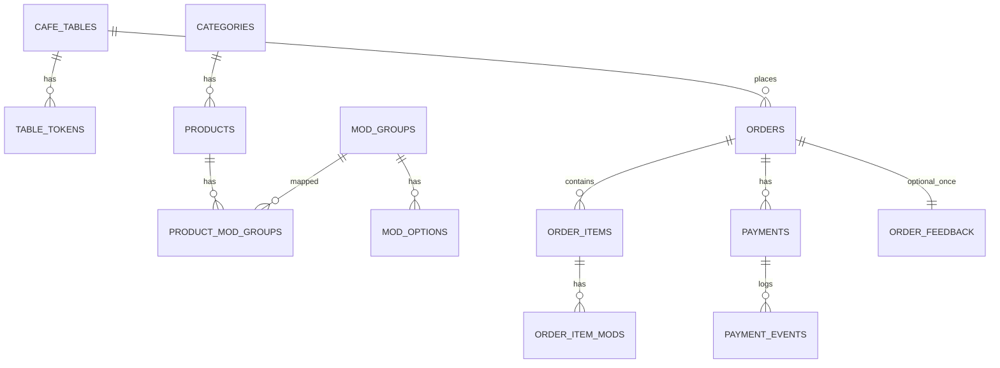

# Rancangan Sistem **Cafe QR Ordering** (Laravel 12 + iPaymu)

> Dokumen ini merapikan rancangan “QR Table Ordering” untuk cafe: pelanggan scan QR di meja → pesan menu → bayar iPaymu → tracking status → admin/kasir mengelola order + laporan.  
> Fokus: **mobile-first**, stabil untuk operasional cafe, dan mudah dideploy (monolith Laravel).

---

## Daftar Isi
1. [Tujuan & Prinsip Desain](#tujuan--prinsip-desain)  
2. [Aktor & Peran](#aktor--peran)  
3. [Fitur Utama](#fitur-utama)  
4. [Sitemap / Struktur Halaman](#sitemap--struktur-halaman)  
5. [Alur End-to-End](#alur-end-to-end)  
6. [Status Order & Payment](#status-order--payment)  
7. [Rancangan Database (ERD)](#rancangan-database-erd)  
8. [Rancangan Endpoint (API/Routes)](#rancangan-endpoint-apiroutes)  
9. [Admin/Kasir/KDS](#adminkasirkds)  
10. [Feedback Anonim 1x per Order](#feedback-anonim-1x-per-order)  
11. [Aturan Keamanan & Anti-Abuse](#aturan-keamanan--anti-abuse)  
12. [Dashboard & Laporan](#dashboard--laporan)  
13. [Non-Functional Requirements](#non-functional-requirements)  
14. [MVP vs Next Phase](#mvp-vs-next-phase)  
15. [Catatan Implementasi Laravel 12](#catatan-implementasi-laravel-12)  
16. [Checklist Siap Ngoding](#checklist-siap-ngoding)  

---

## Tujuan & Prinsip Desain

### Tujuan
- **Scan QR Meja → Pesan Cepat → Bayar → Tracking Status**
- Mengurangi antrean, memudahkan kasir/barista, dan mencatat transaksi rapi.
- Menyediakan **dashboard penjualan** dan **manajemen menu** dari admin.

### Prinsip desain (wajib)
1. **Konteks meja ditentukan oleh token QR**  
   - Pelanggan **tidak bisa mengubah nomor meja**.  
   - Server hanya percaya `token → table_id` (bukan input pelanggan).
2. **Nomor meja harus selalu terlihat di UI pelanggan** (read-only)  
   - Untuk double-check agar tidak salah meja.
3. **Mobile-first & responsif**  
   - 90% pengguna = HP.
4. **Status payment terpisah dari status order**  
   - Agar edge-case pembayaran tidak merusak operasional order.
5. **Webhook idempotent**  
   - Callback gateway bisa datang berulang; update harus aman.

---

## Aktor & Peran

- **Pelanggan (HP)**: scan QR, pilih menu, checkout, bayar, tracking, feedback (setelah selesai).
- **Kasir**: lihat order masuk, update status, bantu pembayaran bila gagal.
- **Barista/Dapur** (opsional): melihat antrean (KDS), update progress.
- **Admin**: CRUD menu/kategori/modifier/meja/QR, user & role, laporan.

Rekomendasi role minimal:
- `Admin` (full)
- `Kasir` (orders + status + lihat laporan)
- `Barista` (view queue + update proses/ready)

---

## Fitur Utama

### Sisi Pelanggan (HP)
- Menu kategori + search + filter + badge “Best Seller”
- Detail produk + **modifier** (size/sugar/ice/add-on)
- Catatan per item (notes)
- Keranjang (cart) + ringkasan biaya (subtotal/pajak/service)
- Checkout: isi **Nama** + pilih **Diantar ke meja** / **Ambil di kasir**
- Pembayaran: redirect iPaymu + tombol “Bayar lagi” jika gagal
- Tracking status: **DITERIMA → DIPROSES → READY → SELESAI**
- Feedback anon: **hanya setelah SELESAI** & **1x per order**

### Sisi Admin/Kasir
- Orders board (kanban) per status
- Update status order
- CRUD menu, kategori, modifier, dan sold-out
- Manajemen meja + generate QR per meja (token bisa rotate)
- Dashboard: grafik & KPI
- Feedback moderation (hide/unhide, flagged)

---

## Sitemap / Struktur Halaman

### A. Pelanggan (Mobile-first)
- `/t/{token}` → Landing meja (badge besar “MEJA 07” + tombol Mulai Pesan)
- `/menu` → daftar menu (kategori, search, best seller)
- `/product/{slug}` → detail + modifier + notes + add-to-cart
- `/cart` → keranjang
- `/checkout` → nama + fulfillment + ringkasan biaya
- `/pay/{order_code}` → create transaksi iPaymu, redirect ke payment page
- `/order/{order_code}` → tracking status + status payment + feedback (setelah selesai)

> UX Rule: setiap halaman public menampilkan badge **MEJA XX** (read-only).

### B. Admin/Kasir/Barista
- `/admin/login`
- `/admin/orders` → kanban status + filter (delivery/pickup, paid only, today)
- `/admin/orders/{id}` → detail order + ubah status + print (opsional)
- `/admin/menu` → CRUD produk + sold-out
- `/admin/modifiers` → CRUD modifier group & option
- `/admin/tables` → CRUD meja + QR generator + rotate token
- `/admin/reports` → laporan + export
- `/admin/feedback` → list feedback + moderasi
- `/admin/users` → role management
- `/admin/settings` → pajak/service charge/jam operasional (opsional)

---

## Alur End-to-End

### 1) Alur Pelanggan (Scan → Pesan → Bayar → Tracking)
```mermaid
flowchart TD
  A[Scan QR Meja] --> B[/t/{token} resolve token/]
  B --> C[Session: table_id tersimpan]
  C --> D[/menu pilih item/]
  D --> E[/cart/]
  E --> F[/checkout isi nama + pilih fulfillment/]
  F --> G[Create Order: order_status=DITERIMA]
  G --> H[Create Payment: payment_status=UNPAID]
  H --> I[/pay/{order_code} -> iPaymu redirect/]
  I --> J{Payment sukses?}
  J -- Ya --> K[Webhook notify -> payment=PAID]
  K --> L[/order/{order_code} tracking/]
  J -- Tidak --> M[FAILED/EXPIRED -> tombol Bayar lagi]
  M --> I
```

### 2) Alur Admin/Kasir (Terima → Proses → Ready → Selesai)
```mermaid
flowchart LR
  A[Order masuk: DITERIMA] --> B[Kasir/Barista set DIPROSES]
  B --> C[Set READY]
  C --> D[Set SELESAI]
  D --> E[Customer boleh kirim feedback (1x)]
```

---

## Status Order & Payment

### A. Status Order
- `DITERIMA` (order dibuat)
- `DIPROSES`
- `READY`
- `SELESAI`
- `DIBATALKAN` (stok habis / payment expired / cancel manual)

### B. Status Payment
- `UNPAID`
- `PENDING` (opsional jika gateway asynchronous)
- `PAID`
- `FAILED`
- `EXPIRED`
- `REFUNDED` (opsional)

### Aturan utama (disarankan)
- Order **diproses** hanya jika `payment_status=PAID` (lebih aman operasional).  
  *Opsional kebijakan: boleh proses sebelum paid, tapi lebih rawan dispute.*
- Webhook iPaymu harus **idempotent** (update status tidak dobel).

---

## Rancangan Database (ERD)

### Entitas Master
- `cafe_tables` (meja)
- `table_tokens` (token QR random, bisa rotate)
- `categories`
- `products`
- `mod_groups` (Size/Sugar/Ice/Add-on)
- `mod_options`
- `product_mod_groups` (pivot)

### Entitas Transaksi
- `orders`
- `order_items`
- `order_item_mods`
- `payments`
- `payment_events` (log webhook/callback untuk audit/debug)
- `order_feedback` (feedback anon 1x)

### ER Diagram (ringkas)


### Index & Constraint wajib
- `table_tokens.token` **UNIQUE**
- `orders.order_code` **UNIQUE**
- `payments.gateway_ref` **INDEX** (atau UNIQUE jika pasti unik dari gateway)
- `order_feedback.order_id` **UNIQUE** (enforce 1x feedback per order)
- Index `orders.created_at` untuk laporan cepat

---

## Rancangan Endpoint (API/Routes)

> Bentuk final bisa berupa route web biasa (Blade) + API internal; ini blueprint kontraknya.

### Public (Pelanggan)
- `GET /t/{token}` → resolve token, set session table
- `GET /menu` → list menu
- `GET /product/{slug}` → detail
- `POST /cart/add`
- `POST /checkout` → create order + items
- `POST /pay/{order_code}` → create iPaymu payment, return `payment_url`
- `GET /order/{order_code}` → tracking

### Webhook iPaymu
- `POST /ipaymu/notify` → validate signature, idempotent update payment/order

### Admin
- `GET /admin/orders` + `PATCH /admin/orders/{id}/status`
- CRUD: `/admin/menu`, `/admin/categories`, `/admin/modifiers`, `/admin/tables`
- `GET /admin/reports`
- `GET /admin/feedback` + moderation actions
- `/admin/users` (role)

---

## Admin/Kasir/KDS

### Orders Board (Kanban)
Kolom: **DITERIMA | DIPROSES | READY | SELESAI**  
Card berisi:
- order_code
- **MEJA XX** atau **PICKUP**
- nama pelanggan
- waktu masuk
- badge payment (PAID/UNPAID)

Filter yang berguna:
- Delivery meja vs Pickup
- Paid only
- Today

### KDS (opsional)
- Display antrian besar untuk barista/dapur
- Toggle tampilan: “Diantar ke meja” vs “Ambil di kasir”
- Mode layar penuh

### Print (opsional)
- Struk
- Label cup: order_code, meja, item, notes

---

## Feedback Anonim 1x per Order

### Rule final (sesuai permintaan)
Feedback hanya bisa dikirim jika:
1. `order_status == SELESAI`
2. feedback untuk order tersebut belum ada
3. minimal salah satu terisi: `rating` atau `comment`
4. (recommended) `payment_status == PAID`

### UX
Di halaman `/order/{order_code}`:
- Jika status belum SELESAI → card feedback tidak tampil
- Setelah SELESAI → card feedback muncul
- Setelah submit sukses → tampil “Terima kasih” dan form hilang

### Tabel `order_feedback`
- `order_id` (UNIQUE)
- `rating` (1–5, nullable)
- `comment` (nullable)
- `status` (VISIBLE/HIDDEN)
- `is_flagged` (optional)
- `admin_note` (optional)

### Endpoint
- `POST /api/order/{order_code}/feedback`
  - `403` jika belum SELESAI
  - `409` jika sudah pernah submit
  - `422` jika rating & comment kosong

---

## Aturan Keamanan & Anti-Abuse

1. **Token meja random** (bukan `?table=7`)
2. **Rate limit** endpoint sensitif:
   - webhook
   - feedback
   - create payment
3. **Webhook signature validation** (wajib)
4. **Idempotency** pada webhook (gunakan `gateway_ref` + log `payment_events`)
5. Admin area:
   - auth + role middleware
   - CSRF protection
6. Data privacy:
   - simpan nama pelanggan sekadar untuk operasional (tidak berlebihan)
   - feedback tidak menyimpan identitas

---

## Dashboard & Laporan

Minimal (yang benar-benar kepakai):
- Total sales (hari/minggu/bulan/tahun)
- Total orders
- Top products
- Peak hours (jam ramai)
- AOV (average order value)
- Delivery vs Pickup
- Payment success rate (PAID vs FAILED/EXPIRED)
- Cancel/refund rate
- Export laporan (Excel/PDF)

---

## Non-Functional Requirements

- **Performance**
  - lazy-load gambar menu
  - kompres gambar
  - cache query menu
- **Reliability**
  - webhook diproses via queue (opsional tapi disarankan)
  - audit log perubahan status/harga
- **Usability**
  - UI simple, tombol besar, readable di HP
  - badge MEJA jelas dan konsisten
- **Scalability**
  - siap multi-branch (next phase) tanpa rombak besar

---

## MVP vs Next Phase

### MVP (paling aman untuk launch cepat)
- QR per meja (token terkunci)
- Menu + modifier + notes
- Checkout: nama + fulfillment
- iPaymu redirect payment + webhook notify
- Admin: CRUD menu + kelola order + update status
- Dashboard basic + export

### Next Phase (nice-to-have)
- Voucher/promo code
- Happy hour / time-based pricing
- Bundle/paket
- Tip
- KDS layar khusus
- Label print
- Refund flow resmi
- Multi-branch

---

## Catatan Implementasi Laravel 12

Rekomendasi stack (monolith):
- Laravel 12 + MySQL
- UI pelanggan: Blade + Tailwind + Alpine (ringan)
- Admin: bisa custom atau Filament (opsional)

Layer service yang disarankan:
- `TableContextService` (resolve token → set table context)
- `CartService` (session cart / DB cart)
- `OrderService` (create order + compute totals, transaction-safe)
- `PaymentService` (create iPaymu payment, store URL/ref)
- `WebhookService` (validate signature, idempotent update)
- `ReportService` (aggregate KPI)

---

## Checklist Siap Ngoding

1. Finalisasi status rules (proses hanya setelah PAID atau tidak)
2. Finalisasi perhitungan pajak/service charge (aktif/nonaktif)
3. Buat migrations + seed demo
4. Implement table-token + QR generator
5. Implement order create + cart + totals
6. Implement iPaymu payment redirect + notify handler
7. Implement admin orders board + status update
8. Implement customer tracking page (polling)
9. Implement feedback (rule SELESAI + 1x)
10. Implement reports dasar + export

---

### Lampiran (opsional): Konvensi Kode Order
Contoh: `A-20260203-0001`  
- Prefix cabang/outlet (A)  
- Tanggal (YYYYMMDD)  
- Running number harian  

